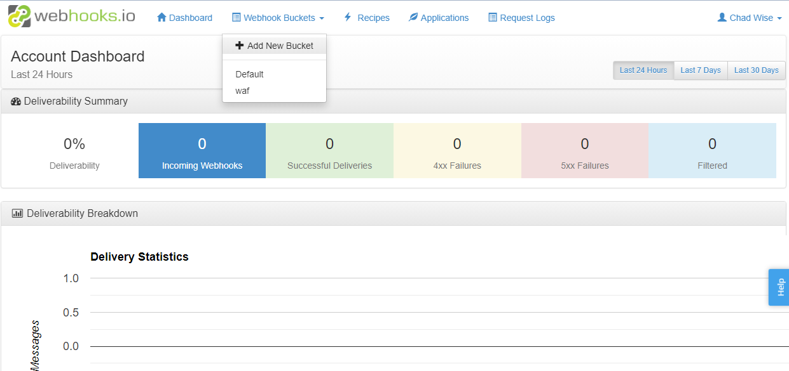
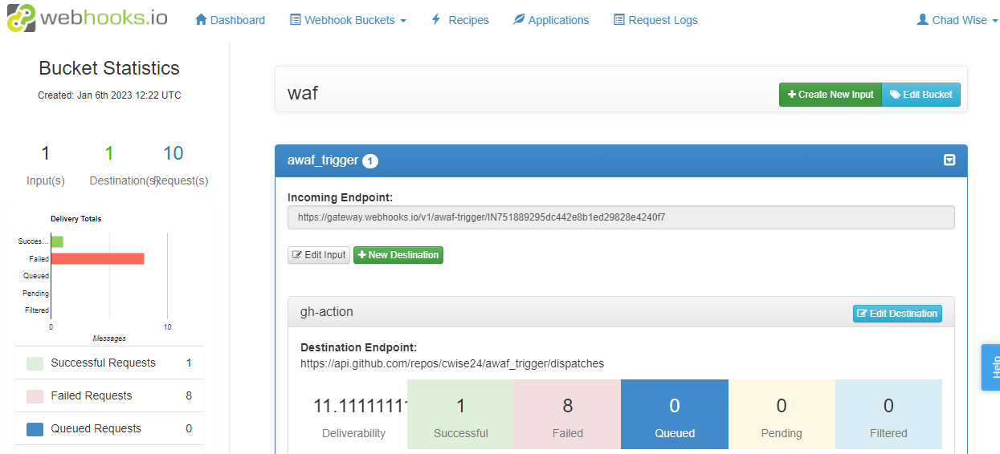

# awaf_trigger

```
 curl -H "authorization: bearer <PAT>" -d "{\"event_type\": \"push\"}" -X POST https://api.github.com/repos/cwise24/awaf_trigger/dispatches
```

# webhook.io

webhook.io [login](https://console.webhooks.io/index.html#/login)

Create a new bucket:



Create a new input:   
Here you will give the input an alias name and it will create an api endpoint   


