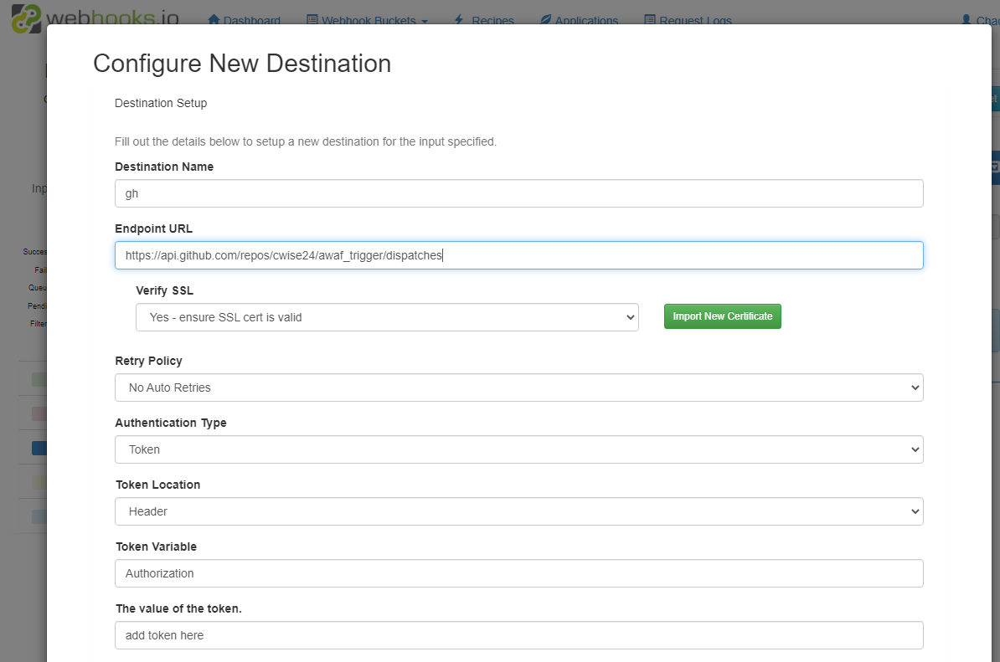

# awaf_trigger

```
 curl -H "authorization: bearer <PAT>" -d "{\"event_type\": \"push\"}" -X POST https://api.github.com/repos/cwise24/awaf_trigger/dispatches
```

# webhook.io

webhook.io [login](https://console.webhooks.io/index.html#/login)

Create a new bucket:


Create a new input:   
Here you will give the input an alias name and it will create an api endpoint   


Add your destination, in this case it's the github API endpoint dispatches see also [trigger_events](https://docs.github.com/en/actions/using-workflows/events-that-trigger-workflows#repository_dispatch)



Create a recipe to add an event type to the payload:


Create a recipe:


Add this recipe back to your destination 
